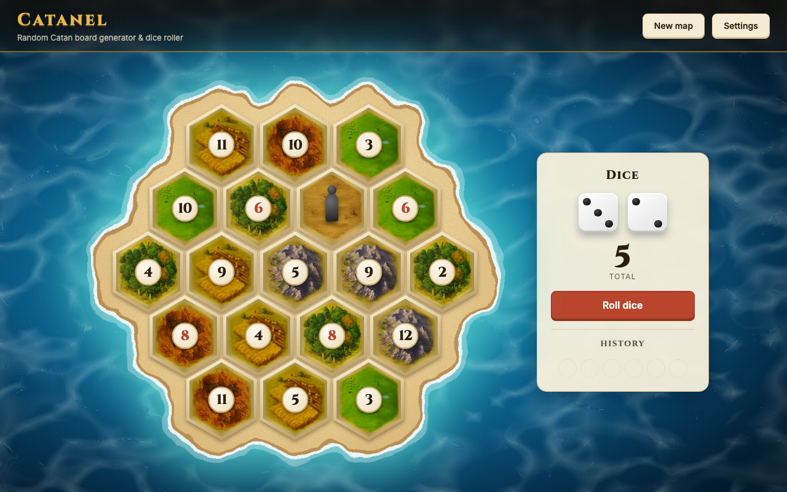

<div align="center">

# 🎲 Catanel

**A random Catan board generator and dice roller for the table, on your phone or desktop.**




</div>

---

## About

Catanel shuffles a fair Catan map in one click and rolls the dice right next to it. Tiles matching each roll light up, so nobody misses their resources. It's a React and TypeScript single-page app that runs entirely in the browser, with no backend and no sign-up. Your settings and the last generated map are saved in `localStorage`, so a reload brings back the same board.

## Features

- 🏝️ **Two board sizes:** the standard 19-hex map for 3–4 players, or the 30-hex extension map for 5–6 players (rows of 3-4-5-6-5-4-3, two deserts, 28 number tokens).
- ⚖️ **Balanced maps (default):** equal numbers, 6 & 8, and 2 & 12 never sit side by side, and no 3 or more tiles of the same resource clump together. Every resource gets a fair share of the good numbers: average dots per tile differ by at most 1 between resources.
- 🎰 **Random maps:** a plain shuffle that only keeps 6 and 8 apart, as in the official setup rules.
- 🎲 **Animated dice:** two dice tumble and flicker through faces before settling on a total. **Clear** blanks the dice and removes the highlight so you can see the whole map again; roll history is kept.
- 🔥 **Roll highlighting:** tiles matching the total get an orange rim and glow while the rest of the board dims. A 7 highlights nothing and shows "Robber moves!".
- 🦹 **Robber:** starts on a desert tile.
- 📜 **Roll history:** the last six totals, newest first, in fixed slots so the panel never changes height.
- ⚙️ **Settings:** choose the player count and Balanced or Random maps, and show or hide the map, the dice or the number tokens. Use dice only with a physical board, or the map only with physical dice. Map and dice can't both be hidden.
- 💾 **Remembers your table:** settings and the last generated map survive a reload. Roll history does not.
- 🌊 **Drawn island:** an SVG coastline traced around the actual tiles, with sand, foam and turquoise shallows, on a still ocean background.
- 📱 **Phone layout:** the map fills the screen with borderless tiles and no beach. In portrait the dice shrink to a one-row bar under the map; in landscape they sit beside it, as on desktop.
- ♿ **Accessible:** the settings dialog is a native `<dialog>`, the switches are real checkboxes, and the option groups behave like radio buttons (arrow keys, Home and End). Roll results are announced to screen readers, and animations respect your reduced-motion setting.

## Controls

| Action                  | Control                                        |
| ----------------------- | ---------------------------------------------- |
| Generate another island | **New map**                                    |
| Roll both dice          | **Roll dice**                                  |
| Clear the current roll  | Eraser button next to **Roll dice**            |
| Open settings           | **Settings** (gear icon on phones)             |
| Close settings          | **Done**, `Esc`, or click outside the dialog   |
| See a tile's resource   | Hover over the tile                            |

Changing the player count or map type generates a new map. The dice start blank. **New map** keeps the dice and roll history. **Roll dice** is disabled while the dice are rolling.

## Getting started

Requires [Node.js](https://nodejs.org/) 22.12+ and [pnpm](https://pnpm.io/).

```sh
git clone git@github.com:Graidenix/catanel.git
cd catanel
pnpm install
pnpm dev
```

Open the URL Vite prints (normally **http://localhost:3001**), or play it live at **[catanel.odajiu.eu](https://catanel.odajiu.eu/)**.

### Scripts

| Command           | What it does                           |
| ----------------- | -------------------------------------- |
| `pnpm dev`        | Start the dev server with hot reload   |
| `pnpm start`      | Alias for `pnpm dev`                   |
| `pnpm build`      | Type-check, then build to `build/`     |
| `pnpm preview`    | Serve the production build locally     |
| `pnpm lint`       | Lint with [oxlint](https://oxc.rs/)    |
| `pnpm test`       | Run Vitest in watch mode               |
| `pnpm test --run` | Run the tests once                     |

The build expects to be served from the domain root. The production URL is hardcoded in `index.html`, `public/robots.txt`, `public/sitemap.xml` and `public/llms.txt`; change it there if you host it elsewhere.

## Project structure

```text
src/
├── index.tsx        # entry: mounts the app inside an error boundary
├── App.tsx          # wires settings, board, dice and the settings dialog
├── components/      # Board, Zone, NumberToken, Island, Ocean, Dice, DicePanel,
│                    # SettingsDialog, PlayerModeToggle, ErrorBoundary
├── hooks/           # useBoard, useSettings, useDiceRoll, useMediaQuery
├── utils/           # board generation, hex layout, board configs, dice, shuffle
└── index.scss       # all styles: layout, island, tokens, dialog, phone layout
public/              # tile textures, icons, manifest, robots, sitemap, llms.txt, OG image
art/                 # source artwork kept out of the deployed build
index.html           # HTML entry, SEO and social meta tags, JSON-LD, fonts
vite.config.ts       # dev server port, build output and Vitest (jsdom) config
```

Tests sit next to the code they cover (`*.test.ts(x)`).

## How it works

- **Board configs:** each player mode in `utils/constants.ts` lists its row lengths, resource tiles and number tokens. Generation, layout and tests all read from these configs, so adding a mode means adding one entry.
- **Generation:** tiles use doubled column coordinates, so neighbours are ±2 in the same row and ±1 in adjacent rows. Both map types always return a board that follows their rules: retries supply the randomness, and a depth-first search is the guaranteed fallback.
  - **Random:** shuffles resources, then reshuffles tokens until no 6 or 8 touches another.
  - **Balanced:** finds a resource layout with no group of 3+ same-resource tiles touching. A depth-first search then places tokens so no neighbours clash (equal numbers, 6/8, 2/12). Boards whose per-resource dot average differs by more than 1 are retried; if none get there, the most even one is kept. This takes about 1–3 ms per board.
- **Hex layout:** `boardLayout()` turns rows into percentage positions using pointy-top hex math. The board scales from a single CSS width, and phones use container queries to fit the space left between the header and the dice bar.
- **Island coastline:** each coast layer is the union of enlarged tile hexes. An SVG blur and alpha-threshold filter melts them into one blob, and a displacement filter roughens the edge. All layers share one noise seed, so the coastlines stay concentric.
- **Persistence:** `useSettings` and `useBoard` read and write `localStorage` defensively. A stored board is reused only if it matches the current player count and map type, has the exact expected types and tiles, has the robber on a desert, and still follows that map type's rules; otherwise a fresh one is generated. Saved settings can never hide both the map and the dice.
- **Dice lifecycle:** `useDiceRoll` flickers faces every 70 ms during a 600 ms roll, then commits the final pair to history. Highlighting uses only the committed total, so nothing lights up mid-roll.

## Credits

CATAN is a trademark of CATAN GmbH. This is a non-commercial fan project made for game nights; it is not affiliated with or endorsed by CATAN GmbH.

Fonts are [Cinzel](https://fonts.google.com/specimen/Cinzel) and [Inter](https://fonts.google.com/specimen/Inter) via Google Fonts. Icons are from [Lucide](https://lucide.dev/).
